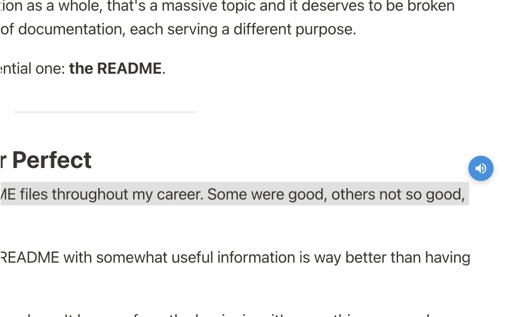
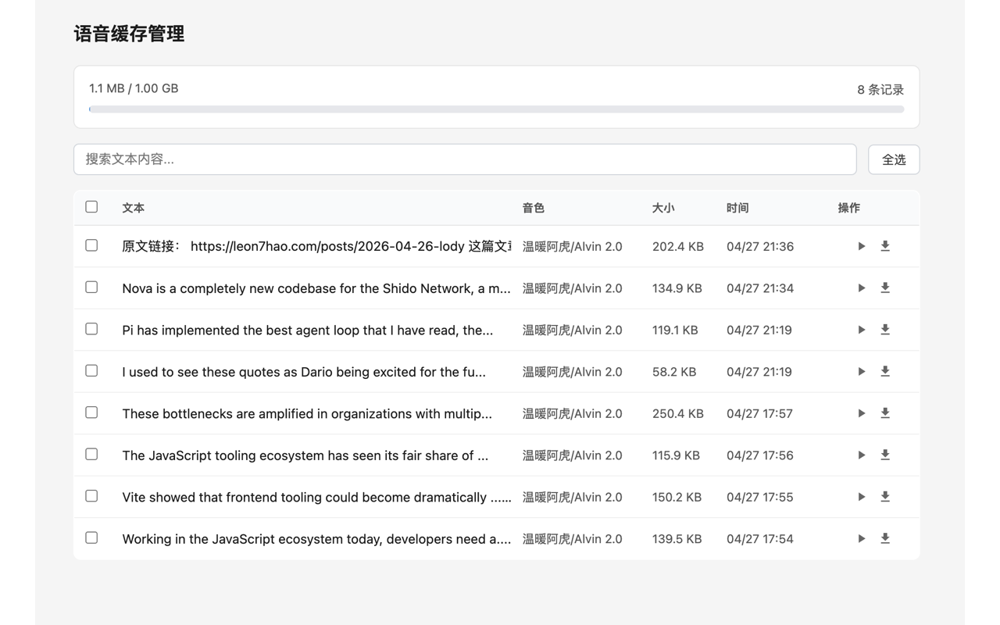

# Tip Voice

Chrome 扩展。选中网页文本，通过火山引擎语音合成 API（豆包 2.0 音色）朗读。

## 功能

- 选中文本点击小喇叭朗读，流式播放
- 100+ 中英文音色可选，语速/音量可调
- 音频自动缓存至 IndexedDB（上限 1GB），相同参数命中缓存直接播放
- 独立缓存管理页面：搜索、播放、下载、批量删除

## 技术栈

Chrome Extension MV3 / React / TypeScript / Vite+ / Volcengine TTS V3 API

## 产品示意图

### 插件配置，仅需一个火山KEY

### 单一的小喇叭功能

### 本地数据存储

