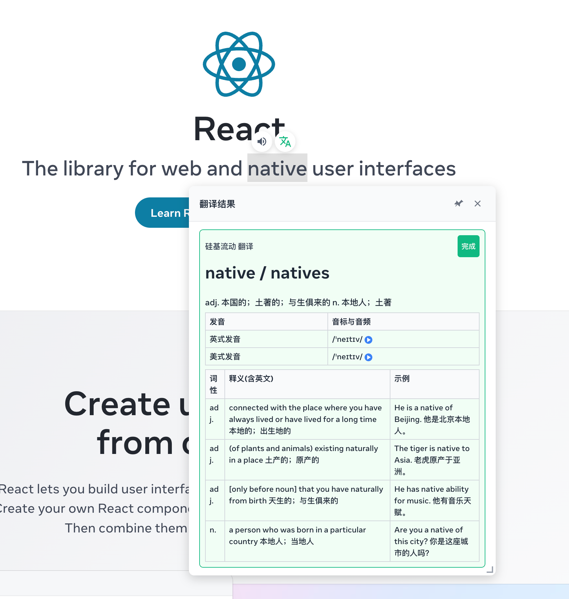
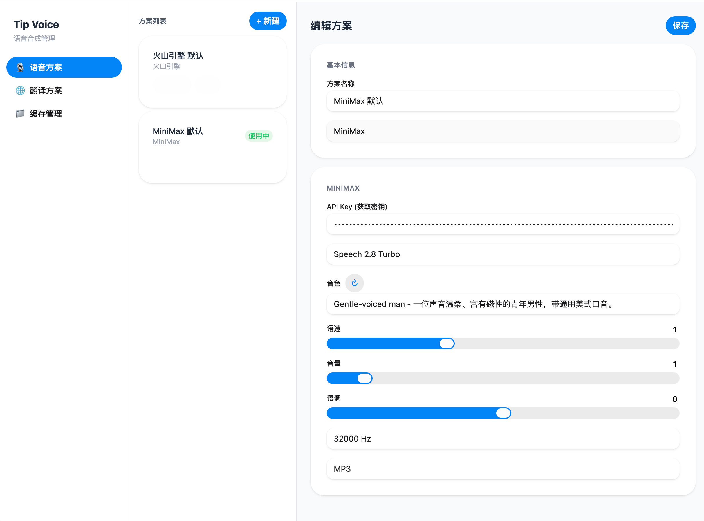
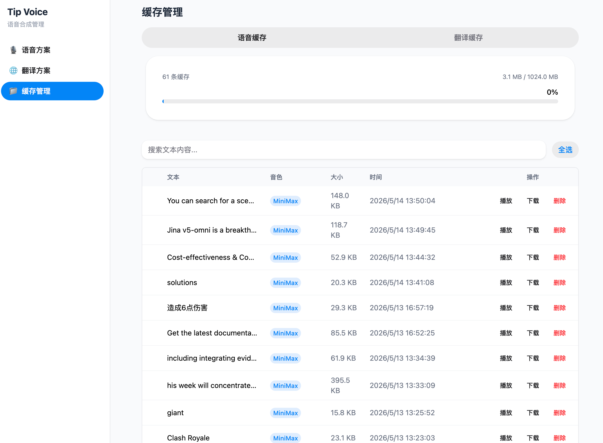

# Tip Voice

Chrome 扩展。选中网页文本，一键朗读与翻译。



## 功能

- **多 Provider TTS**：火山引擎（豆包 2.0）、MiniMax，100+ 中英文音色，语速/音量可调，流式播放
- **划词翻译**：支持 MiniMax、硅基流动等 OpenAI 兼容模型，自定义 Profile（模型、Prompt、参数）
- **音频缓存**：自动写入 IndexedDB（上限 1GB），相同参数命中缓存直接播放
- **管理页面**：Profile 编辑、缓存搜索/播放/下载/批量删除




## 配置

复制 `.env.example` 为 `.env`，按需填写：

```env
VITE_API_KEY=xxxxxxxx-xxxx-xxxx-xxxx-xxxxxxxxxxxx          # 火山引擎 TTS
VITE_API_KEY_MINIMAX=xxxxxxxx-xxxx-xxxx-xxxx-xxxxxxxxxxxx  # MiniMax TTS & 翻译
VITE_API_KEY_SILICONFLOW=sk-xxxxxxxxxxxx                   # 硅基流动 翻译
```

## 技术栈

Chrome Extension MV3 / React 19 / TypeScript / Vite+ / HeroUI / Volcengine TTS V3 / MiniMax / SiliconFlow
